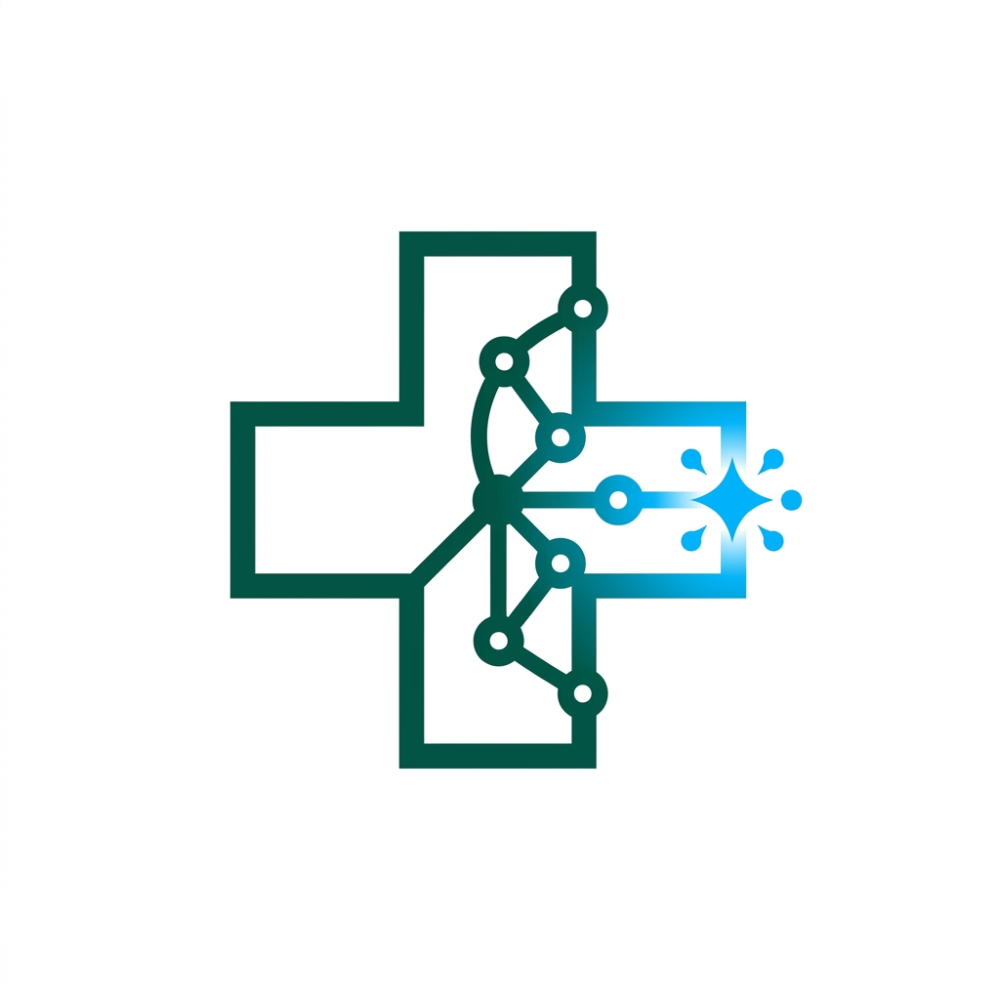

<p align="center">
  
</p>

# 🏥 SEHATI
> **The Paradigm Shift in Personal Healthcare & AI Diagnostics**

SEHATI is not just an application; it is a **revolutionary HealthTech ecosystem** engineered to redefine the boundaries of medical intelligence. Merging high-fidelity aesthetics with cutting-edge Artificial Intelligence, SEHATI delivers a seamless, premium, and life-changing experience that empowers users to master their health with unprecedented precision.

---

## 🚀 The SEHATI Experience

### 🤖 Hyper-Intelligent AI Assistant
Experience the future with our **Neural Health Oracle**. SEHATI's AI doesn't just respond; it understands. It provides real-time, sophisticated medical guidance and health insights, acting as a personal physician in your pocket.

### 📰 Predictive Disease Insights
Stay light-years ahead of global health trends. Our **Real-Time Global Surveillance** system aggregates and analyzes news from the world's most elite medical sources (WHO, CDC, Kemenkes), delivering critical alerts with high-fidelity visual data and regional precision.

### 🔐 Ironclad Security & Bio-Authentication
Your data is more than personal; it's sacred. SEHATI implements **Military-Grade Security Protocols**, featuring:
- **Quantum-Safe Authentication**: Seamless Google Integration.
- **Dynamic MFA Engine**: Next-generation OTP verification via encrypted channels.
- **Encrypted App Passwords**: An additional layer of unbreachable security for your medical records.

### 👤 Adaptive Profile Architecture
Manage your medical identity with an **Elegant Cloud-Native Core**. From secure biometric-ready profile storage to an intelligent account deactivation "Cool-Down" protocol, SEHATI respects your data and your peace of mind.

### 🎨 Masterpiece UI/UX
Designed with a **Meticulous Mint-Teal Aesthetic**, SEHATI features:
- **Glassmorphic Interfaces**: Depth and clarity in every interaction.
- **Cinematic Animations**: Fluid transitions that feel alive.
- **Responsive Fluidity**: Perfected for every screen, every time.

---

## 🛠️ State-of-the-Art Tech Stack

### Mobile Frontend Core
- **Engine**: [Flutter](https://flutter.dev/) (3.x+) — The pinnacle of cross-platform performance.
- **Orchestration**: [GetX](https://pub.dev/packages/get) — High-performance state management.
- **Communication**: GetConnect — Ultra-fast, low-latency networking.
- **Aesthetics**: Custom-Engineered Vanilla CSS & Premium UI Widgets.

---

## 🏁 Embark on the Journey

### Prerequisites
- Flutter SDK (Latest Stable)
- A passion for the future of health.

### ⚡ Instant Setup
```bash
# Clone the future
git clone https://github.com/marcellputra/capstone6.git

# Initialize the ecosystem
flutter pub get

# Launch the experience
flutter run
```

---

## 📁 Ecosystem Architecture
```text
SEHATI/
├── lib/                     # Neural Core of the Application
│   ├── core/                # DNA: Themes, Routes, Global Configs
│   ├── data/                # Synapse: Models & API Orchestration
│   └── features/            # Organs: Auth, Home, AI Chatbot, etc.
└── assets/                  # Visual Identity & Illustrations
```

---

## 🛡️ Cyber-Security Excellence
SEHATI is built on a foundation of **Zero-Trust Architecture**:
- **Invisible Secrets**: All sensitive logic is decentralized and protected.
- **Schema-Level Validation**: Every byte of data is verified for integrity.
- **Anti-Brute Force**: Intelligent rate-limiting to repel unauthorized access.

---

## 👥 The Visionaries
- **Capstone Team 6** - *Architects of the SEHATI Ecosystem*

---
*Forged for the Semester 6 Capstone Project. The future of health is here.*
